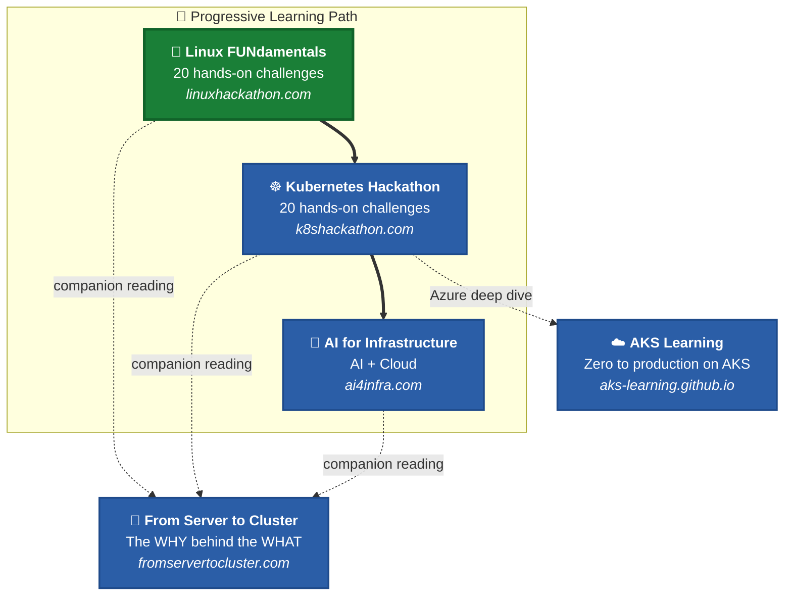

# Hackathon - Linux FUNdamentals

## Introduction

A hands-on, challenge-based hackathon to help you master Linux fundamentals — from basic commands to networking, firewalls, and real-world troubleshooting. 20 challenges, cloud agnostic. Run it on **any cloud provider**, a **local VM**, or even **WSL2**.

> **Note:** This hackathon was incorporated into [Microsoft What The Hack](https://aka.ms/wth) as the first Linux hackathon by Microsoft!

## Linux History

Linux is a family of free and open-source operating systems based on the Linux kernel. Operating systems based on Linux are known as Linux distributions or distros. Examples include Debian, Ubuntu, Fedora, CentOS, Gentoo, Arch Linux, and many others.

The Linux kernel has been under active development since 1991 and has proven to be extremely versatile and adaptable. You can find computers that run Linux in a wide variety of contexts all over the world, from web servers to cell phones. Today, 90% of all cloud infrastructure and 74% of the world's smartphones are powered by Linux.

To read more about Linux history, distributions, and the kernel, [click here](./Student/resources/linux-history.md).

## Learning Objectives

In this hack you will be challenged with common tasks from real-world Linux administration duties, such as:

1. Create a Linux virtual machine
2. Handle files and directories
3. Manipulate file contents
4. Work with standard Linux permissions
5. Collect information about Linux processes in your environment
6. Manage users and groups
7. Basic shell scripting
8. Work with disks, partitions, and logical volume manager
9. Linux package management
10. Implement a basic web server
11. Protect a server with Fail2Ban
12. Run containers with Docker
13. Understand Linux networking fundamentals
14. Manage services with systemd and journalctl
15. Process text with sed, awk, and pipes
16. Schedule tasks with cron and at
17. Configure host-level firewalls with UFW
18. Troubleshoot real-world Linux scenarios

## Challenges

With the exception of Challenge 01 (which sets up the Linux environment required for all other challenges), each challenge can be done separately and they are not interdependent. The level of complexity increases with the challenge number.

| # | Challenge | Description |
|---|-----------|-------------|
| 01 | **[Create a Linux Virtual Machine](Student/Challenge-01.md)** | Set up an Ubuntu Linux environment — cloud VM, local VM, or WSL2 |
| 02 | **[Handling Directories](Student/Challenge-02.md)** | Common directory operations: displaying your current directory and listing contents |
| 03 | **[Handling Files](Student/Challenge-03.md)** | File manipulation: create, rename, find, and remove files |
| 04 | **[File Contents](Student/Challenge-04.md)** | File content manipulation: count lines, display specific lines, and more |
| 05 | **[Standard File Permissions](Student/Challenge-05.md)** | Linux standard file permissions and ownership management |
| 06 | **[Process Management](Student/Challenge-06.md)** | Basic process management: checking running processes and identifying PIDs |
| 07 | **[Group and User Management](Student/Challenge-07.md)** | Creation of users and groups in a Linux environment |
| 08 | **[Scripting](Student/Challenge-08.md)** | Basic shell scripting with echo, cut, read, and grep |
| 09 | **[Disks, Partitions and File Systems](Student/Challenge-09.md)** | Linux filesystems and commands: fdisk, mkfs, and mount |
| 10 | **[Logical Volume Manager](Student/Challenge-10.md)** | LVM commands: pvcreate, vgcreate, lvcreate, and more |
| 11 | **[Package Management](Student/Challenge-11.md)** | Package management: update lists, install, and uninstall packages |
| 12 | **[Setting up a Webserver](Student/Challenge-12.md)** | Set up Nginx + PHP-FPM and deploy a simple web application |
| 13 | **[Protecting a Server](Student/Challenge-13.md)** | Use Fail2Ban to protect services in a Linux environment |
| 14 | **[Running Containers](Student/Challenge-14.md)** | Deploy an Nginx container with Docker and optionally build a custom image |
| 15 | **[Networking Fundamentals](Student/Challenge-15.md)** | IP addresses, DNS resolution, routing, ports, and connectivity tools |
| 16 | **[systemd & Service Management](Student/Challenge-16.md)** | Manage services with systemctl, view logs with journalctl, create custom units |
| 17 | **[Text Processing](Student/Challenge-17.md)** | Master sed, awk, pipes, and text manipulation pipelines |
| 18 | **[Task Scheduling](Student/Challenge-18.md)** | Automate tasks with cron jobs and one-time scheduling with at |
| 19 | **[Firewall Configuration](Student/Challenge-19.md)** | Control network access with UFW — allow, deny, and rate limiting |
| 20 | **[Linux Troubleshooting](Student/Challenge-20.md)** | Capstone: diagnose and fix three real-world scenarios |

## Prerequisites

- **A Linux environment** — choose one:
  - :cloud: **Cloud VM**: Azure, AWS, GCP, or any cloud provider — create an Ubuntu 24.04 LTS VM
  - :computer: **Local VM**: VirtualBox, UTM, Hyper-V, or VMware with Ubuntu 24.04 LTS
  - :window: **WSL2**: Windows Subsystem for Linux (Ubuntu)
  - :desktop_computer: **Existing server**: Any Ubuntu/Debian-based Linux system

- **Access to a terminal**. The terms "terminal," "shell," and "command line interface" are often used interchangeably, but there are subtle differences:
  - A **terminal** is an input/output environment that presents a text-only window running a shell.
  - A **shell** is a program that exposes the operating system to a user. In Linux, the shell in a terminal is a command-line interpreter.
  - A **command-line interface (CLI)** processes commands and outputs results.

  Becoming a Linux expert requires you to be comfortable with using a terminal. Any administrative task — file manipulation, package installation, user management — can be accomplished through the terminal. The terminal is interactive: you type commands and press ENTER to execute them.

- **Background knowledge** (optional but helpful):
  - [Basic Linux concepts](./Student/resources/concepts.md)
  - [Filesystem Hierarchy Standard (FHS)](./Student/resources/fhs.md)
  - [Linux commands cheat sheet](./Student/resources/commands.md)
  - The Linux `man` pages are your best friend. Make sure to use them!

## Learning Resources

* [Linux Journey](https://linuxjourney.com/)
* [Linux Upskill Challenge](https://linuxupskillchallenge.org/)
* [Beginner's Guide for Linux — Tecmint](https://www.tecmint.com/free-online-linux-learning-guide-for-beginners/)
* [Preparation for Linux Foundation Certified System Administrator](https://github.com/Bes0n/LFCS)
* [Linux Foundation Certified System Administrator (LFCS) Notes](https://github.com/simonesavi/lfcs)
* [The Linux Documentation Project](https://tldp.org/)
* [Introduction to Linux — TLDP](https://tldp.org/LDP/intro-linux/intro-linux.pdf)
* [Linux Commands Notes for Professionals](https://goalkicker.com/LinuxBook/LinuxNotesForProfessionals.pdf)
* [Introduction to Linux — Free course on Linux Foundation](https://training.linuxfoundation.org/training/introduction-to-linux/)

## What's Next?

Once you have mastered Linux fundamentals, take your skills to the next level:

:rocket: **[Kubernetes Hackathon](https://k8shackathon.com)** — From Linux admin to Kubernetes expert. 20 hands-on challenges covering 100% of CKA + CKAD + CKS certification domains.

:book: **[From Server to Cluster](https://fromservertocluster.com)** — The companion book that bridges Linux and Kubernetes. Understand the WHY behind every concept.

:robot: **[AI for Infrastructure Professionals](https://ai4infra.com)** — Learn how AI is transforming infrastructure management.

:cloud: **[AKS Learning](https://aks-learning.github.io)** — Using Azure? Go from zero to production on Azure Kubernetes Service — networking, security, observability, scaling, and GitOps.

## Coach's Guide

In the [Coach](./Coach/) directory are the guidelines for running the hackathon as an event, as well as the solutions for the proposed challenges. If you are doing the hackathon as a student, don't look at the solutions during the hack! Go learn something. :)

## Contributions

Contributions in the form of bug reports, feature requests, and PRs are always welcome. Please follow these steps before submitting a PR:

1. Create an issue describing the bug or feature request.
2. Clone the repository and create a topic branch.
3. Make changes, adding new tests for new functionality.
4. Submit a PR.

## License

This project is licensed under the [MIT License](LICENSE).

## Learning Path

This hackathon is the starting point of a complete learning journey:

## :globe_with_meridians: Portuguese Content

:brazil: **This hackathon is also available in Brazilian Portuguese!**
Check out the [`pt-br`](https://github.com/ricmmartins/fasthack-linux/tree/pt-br) branch for the full translated version of all challenges, coach guides, and documentation.

For additional articles, tutorials, and resources on Linux, Kubernetes, and Cloud Infrastructure in Portuguese, visit **[ricardomartins.com.br](https://ricardomartins.com.br)**.

## Show your support

Give a :star: if this content helped you!

---

**Disclaimer:** This is an independent, personal project — not an official Microsoft publication. The views and content are solely the author's own.

Created by **[Ricardo Martins](https://rmmartins.com)** — Principal Solutions Engineer @ Microsoft