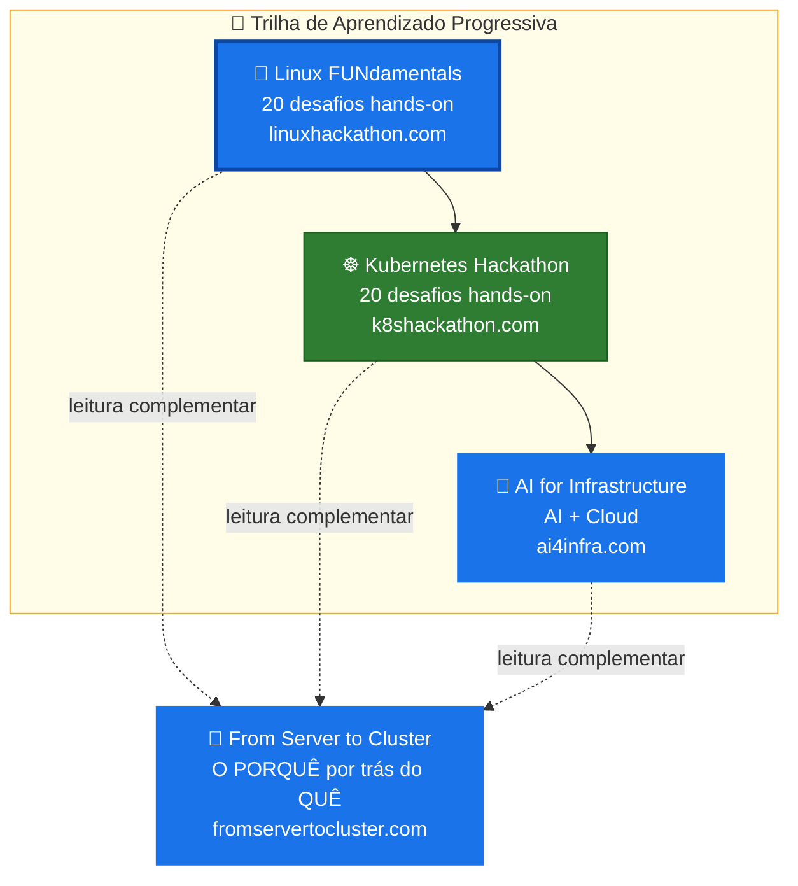

# Hackathon - Linux FUNdamentals

## Introdução

Este é um recurso de aprendizado criado para ajudar pessoas interessadas a adquirir habilidades em Linux e compreender conceitos básicos de linha de comando usando o Azure para construir e aprender. Porém, não se restringe ao uso do Azure e você pode executar este hackathon em qualquer máquina virtual com Ubuntu Linux.

> Nota: Este Hackathon foi incorporado ao Microsoft What The Hack, como o 1º "Hackathon" de Linux pela Microsoft! Saiba mais em [http://aka.ms/wth](http://aka.ms/wth)

## História do Linux

Linux é uma família de sistemas operacionais livres e de código aberto baseados no kernel Linux. Sistemas operacionais baseados em Linux são conhecidos como distribuições Linux ou distros. Exemplos incluem Debian, Ubuntu, Fedora, CentOS, Gentoo, Arch Linux e muitos outros.

O kernel Linux está em desenvolvimento ativo desde 1991, e provou ser extremamente versátil e adaptável. Você pode encontrar computadores que executam Linux em uma grande variedade de contextos ao redor do mundo, desde servidores web até telefones celulares. Hoje, 90% de toda a infraestrutura em nuvem e 74% dos smartphones do mundo são alimentados pelo Linux.

Para ler mais sobre a História do Linux, Distribuições Linux e Kernel Linux, [clique aqui](./Student/resources/linux-history.md).

## Objetivos de Aprendizado

Neste hack você será desafiado com algumas tarefas comuns de um cenário real de administração Linux, como:

1. Criar uma Máquina Virtual Linux no Azure
2. Manipular arquivos e diretórios
3. Manipular conteúdos de arquivos
4. Trabalhar com permissões padrão do Linux
5. Coletar informações sobre processos Linux em seu ambiente
6. Gerenciamento de usuários e grupos
7. Scripts básicos em shell
8. Trabalhar com discos, partições e gerenciador de volumes lógicos
9. Gerenciamento de pacotes Linux
10. Implementar um servidor web básico

## Desafios

Com exceção do desafio 01 (que configura o ambiente Linux necessário para todos os outros desafios), cada desafio pode ser feito separadamente e eles não são interdependentes. O nível de complexidade aumenta com o número do desafio.

| # | Desafio | Descrição |
|---|---------|-----------|
| 01 | **[Criar uma Máquina Virtual Linux](Student/Challenge-01.md)** | Configure um ambiente Ubuntu Linux — VM na nuvem, VM local ou WSL2 |
| 02 | **[Manipulando Diretórios](Student/Challenge-02.md)** | Operações comuns com diretórios: exibir seu diretório atual e listar conteúdo |
| 03 | **[Manipulando Arquivos](Student/Challenge-03.md)** | Manipulação de arquivos: criar, renomear, encontrar e remover arquivos |
| 04 | **[Conteúdo de Arquivos](Student/Challenge-04.md)** | Manipulação de conteúdo de arquivos: contar linhas, exibir linhas específicas e mais |
| 05 | **[Permissões Padrão de Arquivos](Student/Challenge-05.md)** | Permissões padrão de arquivos Linux e gerenciamento de propriedade |
| 06 | **[Gerenciamento de Processos](Student/Challenge-06.md)** | Gerenciamento básico de processos: verificar processos em execução e identificar PIDs |
| 07 | **[Gerenciamento de Grupos e Usuários](Student/Challenge-07.md)** | Criação de usuários e grupos em um ambiente Linux |
| 08 | **[Scripting](Student/Challenge-08.md)** | Scripts básicos em shell com echo, cut, read e grep |
| 09 | **[Discos, Partições e Sistemas de Arquivos](Student/Challenge-09.md)** | Sistemas de arquivos Linux e comandos: fdisk, mkfs e mount |
| 10 | **[Gerenciador de Volumes Lógicos](Student/Challenge-10.md)** | Comandos LVM: pvcreate, vgcreate, lvcreate e mais |
| 11 | **[Gerenciamento de Pacotes](Student/Challenge-11.md)** | Gerenciamento de pacotes: atualizar listas, instalar e desinstalar pacotes |
| 12 | **[Configurando um Servidor Web](Student/Challenge-12.md)** | Configurar Nginx + PHP-FPM e implantar uma aplicação web simples |
| 13 | **[Protegendo um Servidor](Student/Challenge-13.md)** | Usar Fail2Ban para proteger serviços em um ambiente Linux |
| 14 | **[Executando Containers](Student/Challenge-14.md)** | Implantar um container Nginx com Docker e opcionalmente construir uma imagem personalizada |
| 15 | **[Fundamentos de Rede](Student/Challenge-15.md)** | Endereços IP, resolução DNS, roteamento, portas e ferramentas de conectividade |
| 16 | **[systemd e Gerenciamento de Serviços](Student/Challenge-16.md)** | Gerenciar serviços com systemctl, visualizar logs com journalctl, criar units personalizadas |
| 17 | **[Processamento de Texto](Student/Challenge-17.md)** | Dominar sed, awk, pipes e pipelines de manipulação de texto |
| 18 | **[Agendamento de Tarefas](Student/Challenge-18.md)** | Automatizar tarefas com cron jobs e agendamento único com at |
| 19 | **[Configuração de Firewall](Student/Challenge-19.md)** | Controlar acesso à rede com UFW — permitir, negar e limitar taxa |
| 20 | **[Troubleshooting Linux](Student/Challenge-20.md)** | Capstone: diagnosticar e corrigir três cenários do mundo real |

## Pré-requisitos

- Para executar este hackathon no Azure e utilizar o Azure Cloud Shell, você precisará de uma assinatura Azure com acesso de contribuidor para o Desafio 01 ou acesso de contribuidor a uma Máquina Virtual Azure pré-criada para todos os outros desafios. Para executar este hackathon em qualquer outro provedor de nuvem ou localmente, você só precisa de uma máquina virtual executando Ubuntu Linux.
- Acesso a um terminal. Os termos "terminal", "shell" e "interface de linha de comando" são frequentemente usados de forma intercambiável, mas existem diferenças sutis entre eles:
  * Um terminal é um ambiente de entrada e saída que apresenta uma janela somente texto executando um shell.
  * Um shell é um programa que expõe o sistema operacional do computador a um usuário ou programa. Em sistemas Linux, o shell apresentado em um terminal é um interpretador de linha de comando.
  * Uma interface de linha de comando é uma interface de usuário (gerenciada por um programa interpretador de linha de comando) que processa comandos para um programa de computador e exibe os resultados.

  Quando alguém se refere a um desses três termos no contexto do Linux, geralmente significa um ambiente de terminal onde você pode executar comandos e ver os resultados impressos no terminal.

  Tornar-se um especialista em Linux requer que você esteja confortável usando um terminal. Qualquer tarefa administrativa, incluindo manipulação de arquivos, instalação de pacotes e gerenciamento de usuários, pode ser realizada através do terminal. O terminal é interativo: você especifica comandos para executar e o terminal exibe os resultados desses comandos. Para executar qualquer comando, você digita no prompt e pressiona ENTER.

  Para nossas atividades, é recomendado usar o [Azure Cloud Shell](http://shell.azure.com/).

- Existem alguns conceitos básicos que seria bom conhecer. Se quiser dar uma olhada, eles estão [listados aqui](./Student/resources/concepts.md).
- Conceitos sobre o Linux Filesystem Hierarchy Standard (FHS) são recomendados, então você pode obter mais detalhes [aqui](./Student/resources/fhs.md).
- Em relação aos comandos Linux, apenas como referência, [aqui está](./Student/resources/commands.md) um bom guia rápido.
- As páginas man do Linux são suas melhores amigas. Certifique-se de usá-las da melhor forma possível.

## Recursos de Aprendizado

* [Linux Journey](https://linuxjourney.com/)
* [Linux Upskill Challenge](https://linuxupskillchallenge.org/)
* [Guia para Iniciantes em Linux - Tecmint](https://www.tecmint.com/free-online-linux-learning-guide-for-beginners/)
* [Preparação para Linux Foundation Certified System Administrator](https://github.com/Bes0n/LFCS)
* [Notas do Linux Foundation Certified System Administrator (LFCS)](https://github.com/simonesavi/lfcs)
* [The Linux Documentation Project](https://tldp.org/)
* [Introdução ao Linux - do TLDP](https://tldp.org/LDP/intro-linux/intro-linux.pdf)
* [Notas de Comandos Linux para Profissionais](https://goalkicker.com/LinuxBook/LinuxNotesForProfessionals.pdf)
* [Introdução ao Linux - Curso gratuito da Linux Foundation](https://training.linuxfoundation.org/training/introduction-to-linux/)

## Trilha de Aprendizado

Este hackathon é o ponto de partida de uma jornada completa de aprendizado:

## Guia do Coach

No diretório [coach](./Coach/) estão as diretrizes caso você esteja executando o Hackathon em um evento e seja um coach, bem como as soluções para os desafios propostos. Se você está fazendo o Hackathon como estudante, não se engane olhando as soluções durante o hack! Vá aprender algo. :)

## Contribuições

Contribuições na forma de correções de erros, solicitações de funcionalidades e PRs são sempre bem-vindas. Por favor, siga estes passos antes de enviar um PR:

* Crie uma issue descrevendo o erro ou solicitação de funcionalidade.
* Clone o repositório e crie uma branch de tópico.
* Faça as alterações, adicionando novos testes para novas funcionalidades.
* Envie um PR.

## Mostre seu apoio

Dê uma ⭐️ se este conteúdo te ajudou!