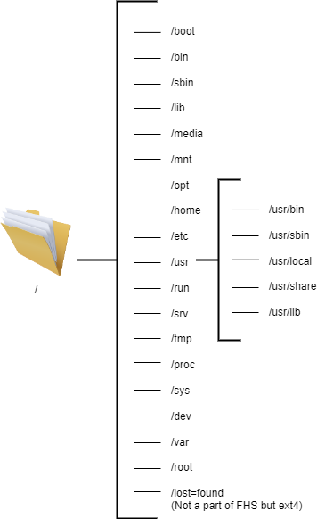

# O Padrão de Hierarquia do Sistema de Arquivos

Quase todas as distribuições Linux estão em conformidade com um padrão universal para a estrutura de diretórios do sistema de arquivos conhecido como Filesystem Hierarchy Standard (FHS). O FHS define um conjunto de diretórios, cada um com sua função especial.

A barra (`/`) é usada para indicar o diretório raiz na hierarquia do sistema de arquivos definida pelo FHS.

Quando um usuário faz login no shell, ele é levado ao seu próprio diretório de usuário, armazenado em `/home/`. Este é referido como o diretório home do usuário. O FHS define `/home/` como contendo os diretórios home dos usuários regulares.

O usuário root tem seu próprio diretório home especificado pelo FHS: `/root/`. Note que `/` é referido como o "diretório raiz", e que é diferente de `root/`, que está armazenado dentro de `/`.

Como o FHS é o layout padrão do sistema de arquivos em máquinas Linux, e cada diretório dentro dele está incluído para servir a um propósito específico, ele simplifica o processo de organização de arquivos por sua função.

## Estrutura do FHS

### **/ (raiz)**

* Este é o início da hierarquia do sistema de arquivos do Linux. Todos os caminhos de arquivo se originam do raiz. Os diretórios listados acima ou links simbólicos para esses diretórios são obrigatórios em / caso contrário, a estrutura de arquivos não está em conformidade com o FHS.

### **/boot**

* Este diretório contém todos os arquivos necessários para o sistema inicializar
* Isso inclui os arquivos do kernel, initrd, initramfs, bootloader etc.

### **/bin**

 * Armazena binários de comandos essenciais que podem ser usados tanto pelo administrador do sistema quanto pelo usuário, como cat, ls, mv, ps, mount etc.
* Esses comandos são usados para inicializar um sistema (acessar arquivos de boot, montar unidades) e podem ser usados ao reparar um sistema quando os binários em /usr não estão disponíveis

### **/sbin**

* Assim como /bin, /sbin também contém binários essenciais do sistema. No entanto, esses binários são destinados apenas para uso do administrador do sistema, e não de um usuário normal.
* Esses binários são usados principalmente para gerenciamento de dispositivos. Por exemplo, fdisk, fsck, mkfs, ifconfig, reboot.

### **/lib**

* Bibliotecas são arquivos de código padrão que definem os comandos usados em uma linguagem de programação. Durante a compilação, um compilador consulta essas bibliotecas para dar sentido ao código, assim como consultamos um dicionário para entender o significado das palavras ao ler um livro.
* Este diretório contém todas as bibliotecas necessárias para inicializar o sistema e para os comandos em /bin e /sbin funcionarem.
* Também contém módulos do kernel que controlam grande parte do funcionamento do seu hardware e dispositivos
* Muitas vezes, existem bibliotecas diferentes de 32 bits e 64 bits com o mesmo nome. Para evitar qualquer conflito, esses binários são mantidos em dois diretórios separados chamados /lib32 e /lib64.

### **/media**

* Este diretório contém vários subdiretórios onde o sistema monta dispositivos removíveis, como drives USB.

### **/mnt**

* Este diretório pode ser usado por um usuário para montar manualmente um dispositivo. (ao contrário de /media que é usado apenas pelo sistema)
* A convenção atual entre os usuários é criar um subdiretório separado em /mnt e montar o dispositivo nesse subdiretório, enquanto a tradição mais antiga é montar o dispositivo diretamente em /mnt.

### **/opt**

* /opt contém bibliotecas e binários relacionados a pacotes que não são instalados pelo gerenciador de pacotes do seu sistema, mas são instalados por meios de terceiros, como usar o botão de atualização dentro do aplicativo do Discord.
* /opt é uma alternativa menos popular ao /usr/local. É o fornecedor quem decide onde as bibliotecas e binários são colocados, mas geralmente softwares mais monolíticos e proprietários como o zoom usam /opt.

### **/home**

* Home contém todos os arquivos pessoais específicos do usuário. Contém diretórios separados para cada usuário que podem ser acessados por cd /home/username
* É aqui que você faz a maior parte do seu trabalho. Todos os downloads, fotos, músicas etc no seu sistema estão em /home.
* O arquivo de configuração específico do usuário para cada aplicação pode ser encontrado em /home/[username]/.conf
* Você pode ir ao diretório home de qualquer usuário executando cd ~[username]. Se há apenas um usuário no sistema, apenas cd ~ funciona.

### **/etc**

* Este diretório contém arquivos de configuração do seu sistema.
* O nome do seu dispositivo, suas senhas, sua configuração de rede, DNS, crontabs, data e hora etc são armazenados aqui em arquivos de configuração.
* Este diretório não pode conter nenhum arquivo binário executável de acordo com o FHS.
* Esses arquivos de configuração afetam todos os usuários do sistema. Se você deseja fazer alterações de configuração para um usuário específico, ~/.conf/ deve ser usado em vez de 
/etc/

### **/usr**

O diretório /usr tem origens muito interessantes. Na época de sua criação, ele deveria funcionar como o diretório /home, mas quando as pessoas ficaram sem espaço em /bin, começaram a armazenar os binários não essenciais em /usr. Você pode ler a história completa [aqui](https://mobile.twitter.com/foone/status/1059310938354987008).

Com o tempo, este diretório foi moldado para armazenar os binários e bibliotecas das aplicações instaladas pelo usuário. Então, por exemplo, enquanto o bash está em /bin (já que pode ser usado por todos os usuários) e o fdisk está em /sbin (já que deve ser usado apenas por administradores), aplicações instaladas pelo usuário como o vlc estão em /usr/bin.

Desta forma, /usr tem sua própria hierarquia, assim como / (raiz).

#### /usr/bin

* Este é o diretório principal de comandos executáveis no sistema.
* Contém todos os binários de comandos instalados pelo usuário 
* Se você deseja executar seus scripts usando um único comando, geralmente os coloca em /usr/bin/

#### **/usr/sbin**

* Contém binários de comandos instalados pelo usuário que só podem ser usados por administradores do sistema.

#### **/usr/lib**

* Contém as bibliotecas essenciais para pacotes em /usr/bin e /usr/sbin, assim como /lib.

#### **/usr/local**

* É usado para todos os pacotes que são compilados manualmente a partir do código-fonte pelo administrador do sistema.
* Este diretório tem sua própria hierarquia com todas as pastas bin, sbin e lib que contêm os binários e aplicações dos softwares compilados.

#### **/usr/share**

* Contém vários arquivos diversos independentes de arquitetura
* Arquivos man, lista de palavras (dicionários) e arquivos de definição estão todos incluídos aqui.

**O caso da fusão /usr – Existe realmente uma diferença entre /bin e /usr/bin?**

A necessidade de mover binários não essenciais para uma pasta diferente surgiu historicamente da falta de espaço no disco rígido de /bin. No entanto, isso foi em 1971. Hoje, mais de 50 anos depois, não enfrentamos mais os mesmos problemas de espaço. Isso tornou duas pastas separadas para binários padrão e instalados pelo usuário inúteis. Com o tempo, isso também causou uma confusão nos sistemas de arquivos, com ambos os diretórios tendo binários redundantes, o que torna tudo confuso.

Por esse motivo, ao longo dos anos, muitas distribuições (Debian, Fedora, Ubuntu, Arch etc.) fundiram /usr/bin e /bin no mesmo diretório.

Da mesma forma, /usr/sbin – /sbin e /usr/lib – /lib foram fundidos no mesmo diretório para simplificar a estrutura de diretórios. Agora a pasta /bin é apenas um link simbólico para o diretório /usr/bin e o mesmo para as outras fusões.

Você pode ler mais sobre a discussão a respeito dessas fusões [aqui](https://www.freedesktop.org/wiki/Software/systemd/TheCaseForTheUsrMerge/) e [aqui](https://www.linux-magazine.com/Issues/2019/228/Debian-usr-Merge).

### **/run**

* Este diretório contém os metadados do dispositivo desde a última inicialização.
* Isso inclui dados de todos os processos do sistema e daemons que foram executados na sessão atual.
* Os arquivos neste diretório são limpos (removidos ou truncados) no início do processo de inicialização.

### **/srv**

* Você só usará este diretório se seu dispositivo estiver funcionando como um servidor web, pois este diretório contém todos os arquivos relacionados a servidores web.
* Por exemplo, se você hospedar um servidor FTP, todos os arquivos que precisam ser compartilhados devem, por padrão, ir em /srv/ftp.

### **/tmp**

* Contém arquivos temporários dos processos em execução no momento.
* Esses dados também são apagados após cada inicialização.

### **/proc**

* Assim como /dev que fornece dispositivos como arquivos, esta pasta contém informações do sistema e do kernel como arquivos.
* Isso inclui informações sobre memória, partições, hardware (bateria, temperatura, etc.), todos os módulos do kernel carregados, etc.

### **/sys (específico da distribuição)**

* Contém informações semelhantes às mantidas em /proc/, mas exibe uma visão hierárquica de informações específicas de dispositivos em relação a dispositivos hot plug.

### **/dev**

* Contém arquivos de dispositivo para todos os dispositivos físicos e virtuais montados no sistema.
* Arquivos de dispositivo não são arquivos no sentido tradicional. Eles são uma forma de os drivers de dispositivo acessarem e interagirem com o dispositivo em questão
* Geralmente o armazenamento primário é chamado de sda (/dev/sda)

### **/var**

* Contém dados variáveis sobre os processos em execução.
* Isso inclui os logs, cache e spools de todas as aplicações.
* Spools são os dados que estão aguardando processamento adicional. Exemplos são um documento esperando na fila de impressão ou um cabeçalho de e-mail aguardando para ser enviado.

### **/root (opcional)**

* Este é o diretório home do usuário root, ao contrário de /home que é o diretório home dos usuários não-root.

### **/lost+found (recurso do ext4)**

* Embora não esteja listado no FHS, este diretório é gerado automaticamente pelo fsck.
* Ele armazena todos os arquivos órfãos e corrompidos nesta pasta.
* Isso inclui os arquivos que você não conseguiu salvar por causa de uma queda de energia, arquivos corrompidos devido a uma falha no processo de atualização etc.

## Conclusão

Desde 1993, o Filesystem Hierarchy Standard tem sido a diretriz para estruturas de diretórios semelhantes ao Unix. Ele exige que a partição do diretório raiz contenha todos os arquivos que o sistema precisa para inicializar e montar partições adicionais.

Em 2015, o FHS foi integrado ao Linux Standard Base (LSB) e agora é mantido pela Linux Foundation. Para ler mais sobre o padrão FHS atual, recomendo fortemente verificar o [texto completo](https://refspecs.linuxfoundation.org/FHS_3.0/fhs/index.html) da última versão lançada em 2015. Continue explorando!