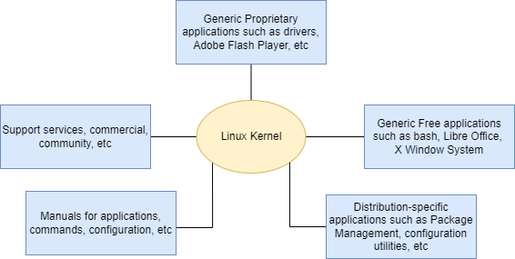
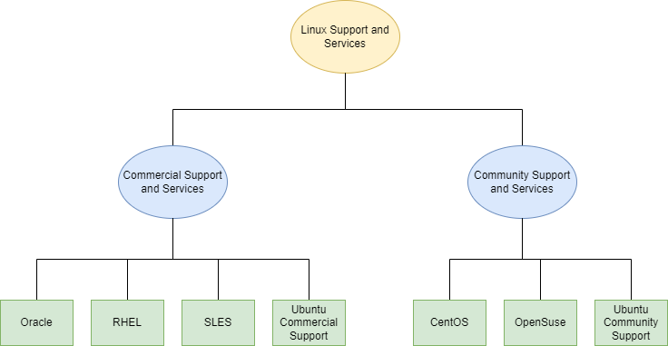
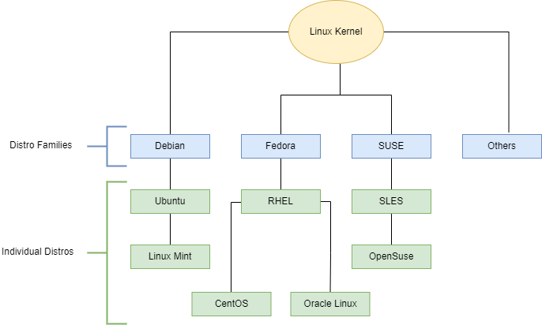

## História do Linux

O Linux é fortemente baseado no sistema operacional UNIX porque foi escrito para ser uma versão livre e de código aberto do UNIX. Os arquivos são armazenados em um sistema de arquivos hierárquico, com o nó superior do sistema sendo o root ou simplesmente "/". 

Sempre que possível, o Linux disponibiliza seus componentes através de arquivos ou objetos que se parecem com arquivos. Processos, dispositivos e sockets de rede são todos representados por objetos semelhantes a arquivos, e muitas vezes podem ser manipulados usando os mesmos utilitários usados para arquivos regulares.

O Linux é um sistema operacional totalmente multitarefa (um método onde múltiplas tarefas são realizadas durante o mesmo período de tempo), multiusuário, com rede integrada e processos de serviço conhecidos como daemons no mundo UNIX. O Linux foi inspirado pelo UNIX, mas não é UNIX.

**Então, o que é uma distribuição Linux e como ela se relaciona com o kernel Linux?**

Como ilustrado abaixo, o [kernel Linux](http://www.kernel.org) é o núcleo de um sistema operacional de computador. Uma **distribuição Linux** completa consiste no kernel mais uma série de outras ferramentas de software para operações relacionadas a arquivos, gerenciamento de usuários e gerenciamento de pacotes de software. Cada uma dessas ferramentas fornece uma pequena parte do sistema completo. Cada ferramenta é frequentemente seu próprio projeto separado, com seus próprios desenvolvedores trabalhando para aperfeiçoar aquela parte do sistema.

Uma vasta variedade de distribuições Linux atende a diferentes públicos e organizações dependendo de suas necessidades específicas. Grandes organizações comerciais tendem a favorecer as distribuições com suporte comercial da Red Hat, SUSE e Canonical (Ubuntu).

**Serviços associados às distribuições**

O CentOS é uma alternativa gratuita popular ao Red Hat Enterprise Linux (RHEL). O Ubuntu e o Fedora são populares no âmbito educacional. O Scientific Linux é preferido pela comunidade de pesquisa científica por sua compatibilidade com pacotes de software científicos e matemáticos. Tanto o CentOS quanto o Scientific Linux são compatíveis em binário com o RHEL; ou seja, pacotes de software binários na maioria dos casos serão instalados corretamente em todas as distribuições.

Muitos distribuidores comerciais, incluindo Red Hat, Ubuntu, SUSE e Oracle, fornecem suporte de longo prazo baseado em taxas para suas distribuições, assim como certificação de hardware e software. Todos os principais distribuidores fornecem serviços de atualização para manter seu sistema atualizado com as últimas correções de segurança e bugs, e melhorias de desempenho, além de fornecer recursos de suporte online.

**Famílias de Distribuições**

**Família Debian**

A distribuição Debian é a base para várias outras distribuições incluindo o Ubuntu, e o Ubuntu é a base para o Linux Mint e outros. É comumente usada tanto em servidores quanto em computadores desktop. O Debian é um projeto puramente de código aberto e foca em um aspecto chave, que é a estabilidade. Também fornece o maior e mais completo repositório de software para seus usuários.

O Ubuntu visa fornecer um bom equilíbrio entre estabilidade de longo prazo e facilidade de uso. Como o Ubuntu obtém a maioria de seus pacotes do branch estável do Debian, o Ubuntu também tem acesso a um repositório de software muito grande. 

_Fatos Importantes Sobre a Família Debian:_

* A família Debian é a base para o Ubuntu, e o Ubuntu é a base para o Linux Mint e outros.
* Utiliza o gerenciador de pacotes apt-get baseado em DPKG (abordaremos em mais detalhes posteriormente) para instalar, atualizar e remover pacotes no sistema.
* O Ubuntu tem sido amplamente usado para implantações em nuvem.

**Família Fedora**

O Fedora é a distribuição comunitária que forma a base do Red Hat Enterprise Linux (RHEL), CentOS, Scientific Linux e Oracle Linux. O Fedora contém significativamente mais software do que a versão empresarial da Red Hat. Uma razão para isso é que uma comunidade diversificada está envolvida na construção do Fedora; não é apenas uma empresa.

_Fatos Importantes Sobre a Família Fedora:_

* A família Fedora é a base para o CentOS, RHEL e Oracle Linux.
* Suporta plataformas de hardware como x86, x86-64, Itanium, PowerPC e IBM System z.
* Utiliza o gerenciador de pacotes yum baseado em RPM (abordaremos em mais detalhes posteriormente) para instalar, atualizar e remover pacotes no sistema.
* O RHEL é amplamente usado por empresas que hospedam seus próprios sistemas.

**Família SUSE**

A relação entre SUSE, SUSE Linux Enterprise Server (SLES) e openSUSE é semelhante à descrita entre Fedora, Red Hat Enterprise Linux e CentOS. 

_Fatos Importantes Sobre a Família SUSE:_

* O SUSE Linux Enterprise Server (SLES) é a base para o openSUSE.
* Utiliza o gerenciador de pacotes zypper baseado em RPM (abordaremos em mais detalhes posteriormente) para instalar, atualizar e remover pacotes no sistema.
* Inclui a aplicação YaST (Yet another System Tool) para fins de administração do sistema.

Como dito, as maiores diferenças entre as distribuições são seus sistemas de gerenciamento de pacotes e ferramentas.
Debian (e distribuições derivadas) usa o formato de pacote Debian (.deb), Red-hat (e distribuições derivadas) usa o formato de pacote RPM (.rpm). E distribuições como Arch e Slackware usam seus próprios formatos e ferramentas de empacotamento.

Diferenças de empacotamento à parte, algumas distribuições - como Debian Testing, Fedora (baseada em Red-hat) e Arch tendem a usar versões mais recentes do kernel Linux e outros pacotes de software. Mas isso vem com o custo de potencial instabilidade e quebras - que podem acontecer de tempos em tempos após atualizações nesses sistemas - embora raramente.

Enquanto distribuições como Debian Stable e RHEL usam versões mais antigas e melhor testadas de software. Embora usem software ligeiramente desatualizado e mais antigo - são consideradas muito mais estáveis. Além disso, os mantenedores de pacotes sempre mantêm o software atualizado com as últimas correções de segurança.